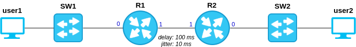

.. _topology:

Topology
========

Once you open a project with gonetem-console, you can modify the topology
with the command ``edit``.
An empty topology looks like that :

.. code-block:: yaml

  nodes:
  links:
  bridges:

The content of each section is explained below.

Nodes
-----

In the section ``nodes``, you can add host/server/router/switch in the topology.
At minimum, each node is identified by :

  1. a name
  2. a type

These 2 information are declared like that :

.. code-block:: yaml

    nodes:
      host_name:
        type: docker.host
      router_name:
        type: docker.router
      switch_name:
        type: ovs

2 main types of node are available in gonetem :

  1. docker node declared with the type ``docker.<type>``
  2. switch declared with the type ``ovs``

More details are given below for each type of node.

Docker node
```````````
A docker node is a container launch by gonetem. Bydefault, 3 kinds of docker node
are available, each one associated to an image defined in the server 
configuration file. These one ared by default:

- mroy31/gonetem-host identified by the type *docker.host*, which emulates a terminal node
- mroy31/gonetem-server identified by the type *docker.server*, which emulates a server node (with http, tftp and dhcp server for now)
- mroy31/gonetem-frr identified by the type *docker.router*, which emulates router based on the software `FRR <https://frrouting.org/>`_

All these images are available on docker hub. It is also possible to use a custom image 
thanks to the options ``image`` (see below). You can also defined new kind of
node in the server configration file. See :ref:`nodes` for more details.

Options
"""""""

Several options are available when you declare a docker node:
  - ``launch`` (boolean, optional): set to no to not start the node at the launch of the project (yes by default) 
  - ``ipv6`` (boolean, optional): set to yes if you want to enable ipv6 support on this node (no by default)
  - ``mpls`` (boolean, optional): set to yes to enable mpls support on this node (no by default).
  - ``image`` (string, optional): set to provide a custom docker image for this node
  - ``volumes`` (string list, optional): Allow to bind host path in container filesystem (like -v option in ``docker run```). The syntax is ``/host/path:/container/path``

VRF support
"""""""""""

To facilitate the implementation of L3VPN with gonetem and FRR, it is possible to instantiate linux VRFs at the launch of FRR router.
For that, you just need to declare list of VRF in the ``vrfs`` parameter.

VRRP support
""""""""""""

FRR supports VRRP protocol. However, its implementation requires some prerequisite to work.
  - The creation of a macvlan interface with the correct MAC/IP adresses for each VRRP group

To facilitate the use of this protocol, gonetem support the parameter ``vrrps`` for ``docker.router`` nodes, for vrrp configuration.
This parameter take a list of object with the following attributes :

- *interface (int)*: physical interface id used for VRRP
- *group (int)*: VRFRP group id
- *address (string)*: VRRP IPv4 address

Example of docker node
""""""""""""""""""""""

.. code-block:: yaml

    nodes:
      R1:
        type: docker.router
        ipv6: yes
        mpls: yes
        volumes:
        - /tmp:/tmp
        vrfs: [VRFA, VRFB]
        vrrps:
        - interface: 0
          group: 1
          address: 192.168.1.252/24

Extra : init script
"""""""""""""""""""

For specific situations, it is possible to include an init script in docker node.
The path is ``/gonetem-init.sh``. If this file exits, it is saved in the .gnet project file and executed at the launch of the node.

Switches
````````

In gonetem, switch is a node like any other. You just need to use the
type ``ovs``. In background, `OpenVSwitch <https://www.openvswitch.org/>`_ is
used to emulate it. A docker container based on ``mroy31/gonetem-ovs``
is launched for each project. All switches are instantiated in this container.

Example of switch nodes
"""""""""""""""""""""""

.. code-block:: yaml

    nodes:
      sw1:
        type: ovs
      sw2:
        type: ovs

When you launch a console on a switch, a custom prompt appears allowing basic
commands on the switch (for now, vlan and bonding configuration).
For more details on available commands, see :ref:`here <ovs>`.

Links
-----

In gonetem, links between nodes are defined in the ``links``. Each link
definition requires the following parameters:

  * ``peer1`` (string, required): left connection of the link, following the format ``<node_name>.<if_number>``
  * ``peer2`` (string, required): right connection of the link, following the format ``<node_name>.<if_number>``
  * ``delay`` (int, optional): delay on the link in ms
  * ``jitter`` (int, optional): jitter on the link in ms
  * ``loss`` (float, optional): loss on the link in percent (between 0.0 and 100.0)
  * ``rate`` (int, optional): link rate in kbits per second
  * ``buffer`` (float, optional): buffer size (equivalent to ``limit`` param in the ``tc`` command). The value has to be set in BDP (Bandwith Delay Product) scale factor (1.0 per default).

Example of links
""""""""""""""""

.. code-block:: yaml

    nodes:
      host:
        type: docker.host
      sw:
        type: ovs
      R1:
        type: docker.router
    links:
      - peer1: host.0
        peer2: sw.0
        loss: 2
      - peer1: R1.0
        peer2: sw.1
        delay: 100 # ms
        jitter: 10 # ms
        rate: 1024 # 1Mbps

Bridges
-------
In the ``bridges:`` section, you can add some bridges to the topology.
A bridge should be declared if you want to communicate with the host network.
A bridge takes 2 arguments:

  * ``host`` (string, required): the name of the host interface that will
    be connected to that bridge
  * ``interfaces`` (list, required): list of node interfaces connected
    to this bridge

Example
```````
.. code-block:: ini

    bridges:
      my_br:
        host: eth0
        interfaces: [R1.0, host.0]


Full example
------------



Below, you will find topology file to create the network above:

.. code-block:: yaml

    nodes:
      user1:
        type: docker.host
      user2:
        type: docker.host
      sw1:
        type: ovs
      sw2:
        type: ovs
      R1:
        type: docker.router
      R2:
        type: docker.router
    links:
      - peer1: user1.0
        peer2: sw1.0
      - peer1: sw1.1
        peer2: R1.0
      - peer1: R1.1
        peer2: R2.1
        delay: 100
        jitter: 10
      - peer1: R2.0
        peer2: sw2.0
      - peer1: sw2.1
        peer2: user2.0
